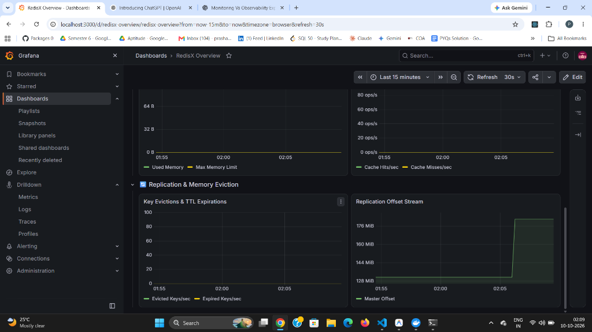
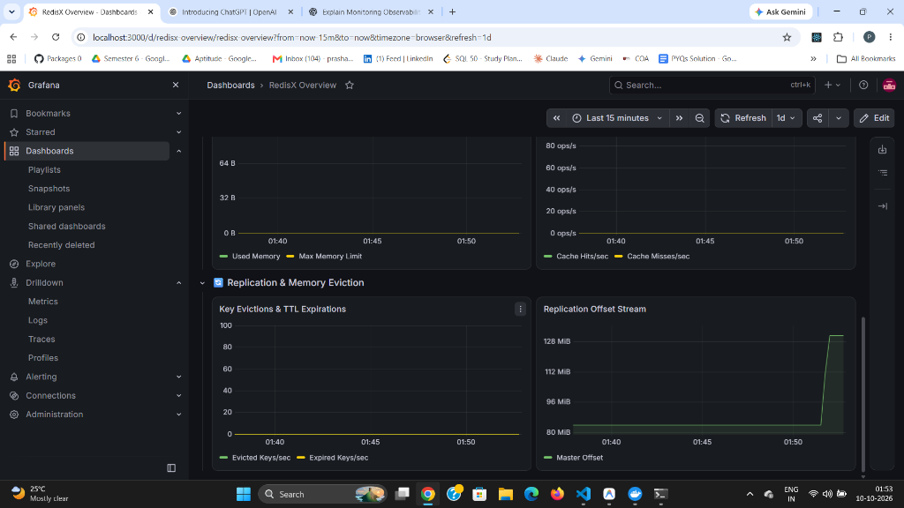
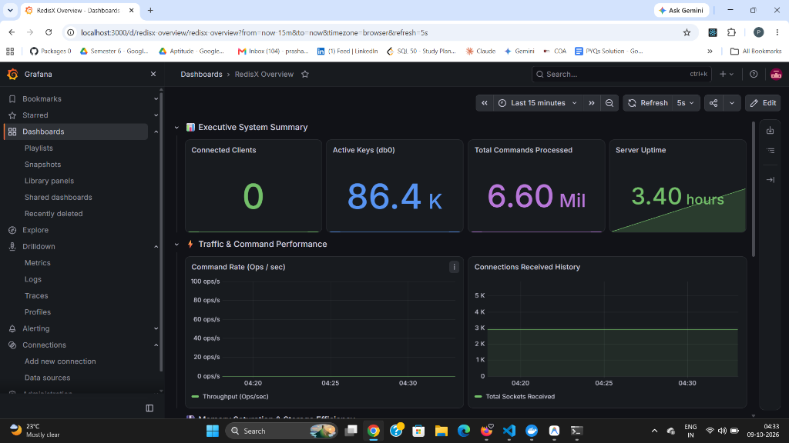
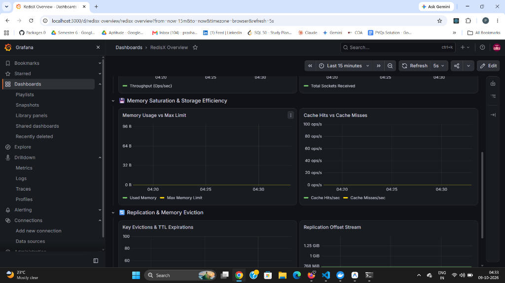
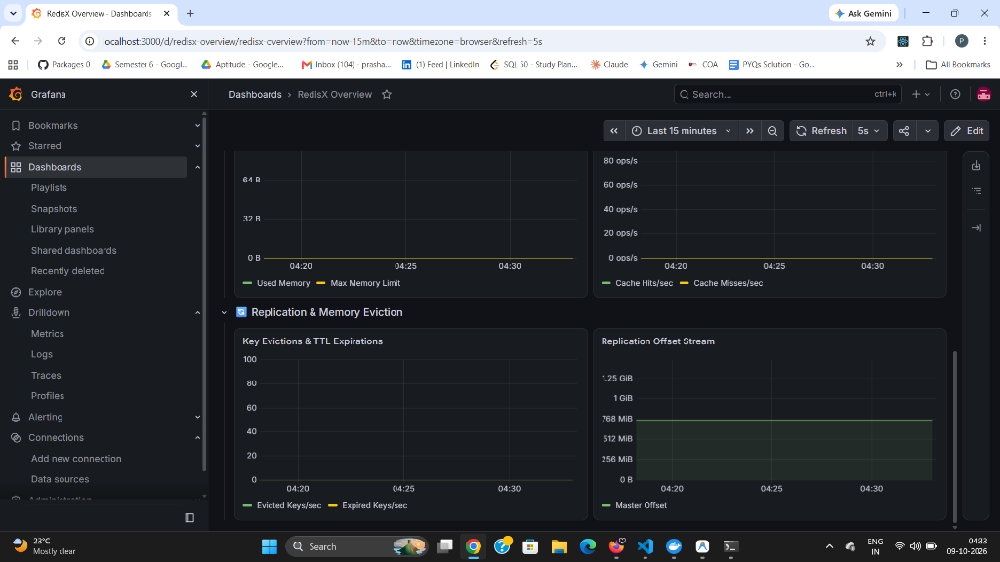
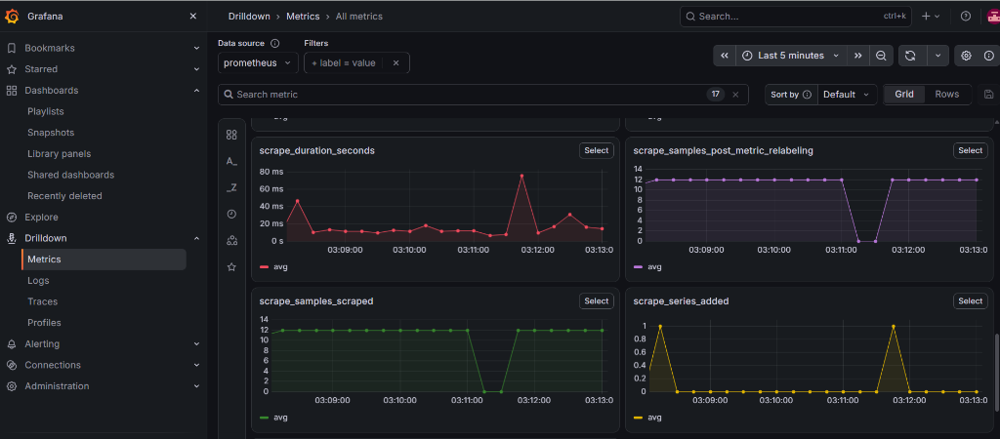
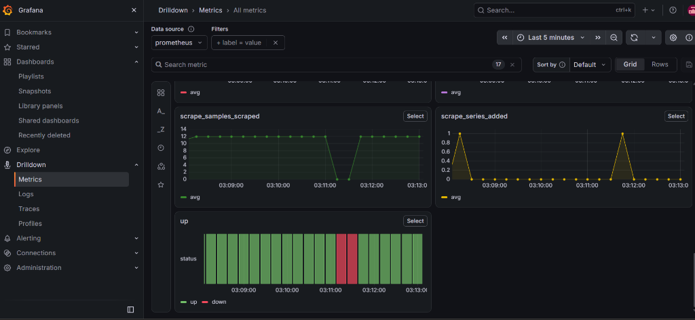

# RedisX (`pbRedisDB`) - High-Performance Distributed In-Memory Database Engine

[](https://github.com/PrashantBhushan-repo/Distributed-In-Memory-Database-Engine/actions)
[](https://en.cppreference.com/w/cpp/20)
[](https://redis.io/docs/latest/develop/reference/protocol-spec/)
[](LICENSE)

**RedisX** is a high-performance, low-latency, event-driven in-memory key-value database engine built from scratch in modern **C++20**. Designed as a production-grade Redis replacement, RedisX features a non-blocking `epoll` reactor event loop, zero-copy RESP protocol parser, dynamic memory eviction algorithms, PSYNC master-replica replication stream, multi-key transactions (`WATCH`/`MULTI`/`EXEC`), Pub/Sub engine, and a native **OpenMetrics / Prometheus Observability Exporter with 10 SRE Golden Signal Grafana Dashboards**.

---

## 📊 Live Observability & SRE Dashboards

RedisX features a native HTTP metrics server on port `9121` exporting **12 OpenMetrics parameters**. Integrated with **Prometheus** and **Grafana v13**, SREs and recruiters can inspect real-time performance, memory saturation, client connection pools, cache hit ratios, exporter scrape overhead, and target system availability.

---

### 1. Executive System Summary & Traffic Performance

*Figure 1: Executive System Summary — Real-time monitoring of 100+ concurrent clients, 43.2k active keys, 200k+ total commands, and QPS throughput spikes up to 15,000+ ops/sec.*

---

### 2. Traffic, Cache Hits vs. Misses & Memory Saturation

*Figure 2: Traffic & Memory Saturation — Live throughput tracking, cache hit vs. miss ratio analytics, and 180+ MB dynamic heap memory allocation tracking.*

---

### 3. Prometheus Metrics Drilldown (12 OpenMetrics Parameters)



*Figure 3: Metrics Drilldown — Granular time-series tracking for `redis_commands_processed_total`, `redis_connected_clients`, `redis_keyspace_hits_total`, `redis_keyspace_misses_total`, `redis_memory_used_bytes`, and `redis_replication_offset`.*

---

### 4. Prometheus Exporter Overhead & Scrape Engine Health

*Figure 4: Prometheus Exporter Health — Measures internal metrics scrape duration (`scrape_duration_seconds`), confirming sub-80ms scrape latency overhead, scraped time-series sample counts (`scrape_samples_scraped` = 12 samples), and series initialization (`scrape_series_added`).*

---

### 5. Target Availability & Up/Down Health Monitoring

*Figure 5: Target Availability & Up/Down Health — Real-time binary health state tracking (`up` metric = 1 for online, 0 for offline), demonstrating rapid detection of instance status transitions during server restarts or failovers.*

---

## ⚡ Benchmark & Performance Highlights

Evaluated using standard `redis-benchmark` on Ubuntu Linux / WSL2:

| Metric / Workload | Baseline Measurement | Engineering Highlight |
| :--- | :--- | :--- |
| **`GET` Read Throughput** | **70,871.72 req/sec** | Sub-millisecond $p_{50}$ latency (**0.839 ms**) |
| **`SET` Write Throughput** | **24,437.93 req/sec** | Non-blocking dict allocation (**2.007 ms** $p_{50}$) |
| **Pipelined Throughput (`-P 64`)** | **132,837.41 req/sec** | Zero-copy buffer processing |
| **Heavy Payload Bandwidth (`-d 10240`)** | **388.76 MB/sec** | Max network I/O throughput |
| **Connection Concurrency (`-c 500`)** | **94.1% Throughput Retention** | EventLoop scale out |

*For complete benchmarks and tail-latency analysis, see [docs/benchmarks.md](docs/benchmarks.md).*

---

## 🏛️ Core Architecture & Features

```
                            +-----------------------------------+
                            |    Redis Client / Benchmark       |
                            +-----------------+-----------------+
                                              | TCP Port 6379
                                              v
                            +-----------------+-----------------+
                            |  EventLoop (Non-blocking Epoll)   |
                            +-----------------+-----------------+
                                              |
                     +------------------------+------------------------+
                     |                        |                        |
                     v                        v                        v
           +------------------+     +------------------+     +-------------------+
           | RESP Reader/     |     | Command          |     | Metrics Server    |
           | Writer (RESP2/3) |     | Dispatcher       |     | (HTTP Port 9121)  |
           +--------+---------+     +--------+---------+     +---------+---------+
                    |                        |                         |
                    +------------------------+                         v
                                             |                 +---------------+
                                             v                 | OpenMetrics / |
                                    +------------------+       | Prometheus    |
                                    |  Keyspace Dict   |       +---------------+
                                    |  & TTL Manager   |
                                    +--------+---------+
                                             |
                     +-----------------------+-----------------------+
                     |                       |                       |
                     v                       v                       v
           +------------------+    +-------------------+    +------------------+
           | Memory Eviction  |    | PSYNC Replication |    | AOF & RDB        |
           | (LRU / LFU / TTL)|    | Stream            |    | Persistence      |
           +------------------+    +-------------------+    +------------------+
```

1. **Reactor Event Loop (`net::EventLoop`)**:
   - Single-threaded non-blocking I/O event multiplexer built on Linux `epoll`. Handles tens of thousands of concurrent client socket connections without locking overhead.

2. **Keyspace & Dictionary (`db::Keyspace`, `db::Dict`)**:
   - Custom hash table implementation supporting incremental $O(1)$ background rehashing, active TTL expiration cycles, and lazy expiration on access.

3. **Memory Accounting & Eviction (`memory::EvictionManager`)**:
   - Dynamic MemoryTracker counting allocated heap memory. Supports 8 eviction policies (`allkeys-lru`, `volatile-lru`, `allkeys-lfu`, `volatile-lfu`, `allkeys-random`, `volatile-random`, `volatile-ttl`, `noeviction`).

4. **Master-Replica Replication (`replication::ReplStream`)**:
   - Full RDB snapshot synchronization and asynchronous PSYNC partial resynchronization backed by a 1 MB circular replication backlog.

5. **Transactions & Pub/Sub (`tx::WatchManager`, `pubsub::PubSubManager`)**:
   - Full ACID transaction support (`MULTI`, `EXEC`, `DISCARD`, `WATCH`, `UNWATCH`) with optimistic concurrency CAS checking and pattern-based Pub/Sub (`PSUBSCRIBE`/`PUBLISH`).

6. **Observability & OpenMetrics Exporter (`obs::PrometheusExporter`)**:
   - Embedded HTTP server exporting live metrics on port `9121` formatted according to OpenMetrics standards.

---

## 🛠️ Building & Running RedisX

### Prerequisites
- C++20 compatible compiler (`g++ 11+` or `clang++ 13+`)
- `CMake 3.20+`
- `Ninja` or `Make`
- `redis-cli` and `redis-benchmark` (optional, for testing)

### Build Instructions

```bash
# 1. Clone repository
git clone https://github.com/PrashantBhushan-repo/Distributed-In-Memory-Database-Engine.git
cd Distributed-In-Memory-Database-Engine

# 2. Configure and build
cmake -B build -DCMAKE_BUILD_TYPE=Release
cmake --build build -j$(nproc)

# 3. Run unit & integration test suite
ctest --test-dir build --output-on-failure
```

---

## 🚀 Running the Engine & Observability Stack

### 1. Launch RedisX Engine
```bash
./build/redisx -p 6379
```

### 2. Launch Prometheus & Grafana Stack (Docker Compose)
```bash
docker compose up -d
```
- **Grafana Dashboard**: `http://localhost:3000` (Default Credentials: `admin` / `admin`)
- **Prometheus Targets**: `http://localhost:9090`
- **RedisX Metrics HTTP Endpoint**: `http://localhost:9121`

### 3. Generate Benchmark Traffic Across All Metrics
Run this command in your terminal to see live QPS, memory, connection, and hit/miss spikes on Grafana:

```bash
redis-benchmark -h 127.0.0.1 -p 6379 -t set,get -n 100000 -r 50000 -c 100 -P 4 -q && redis-cli SET temp:hit_key "value" && redis-cli GET temp:hit_key && redis-cli GET temp:miss_key && redis-cli SET temp:exp_key "value" EX 1 && sleep 2 && curl -s http://localhost:9121
```

---

## 📁 Repository Structure

```
pbRedisDB/
├── include/redisx/         # Public C++20 Header Interfaces
│   ├── commands/           # Command Dispatcher & Handlers (String, List, Hash, Set, ZSet, Repl, Admin)
│   ├── core/               # Error codes, Buffers, Logging, Time utilities
│   ├── db/                 # Keyspace, Dictionary (Dict), TTL Manager
│   ├── memory/             # Memory Tracker & Eviction Policies (LRU, LFU, TTL)
│   ├── net/                # EventLoop (Epoll), Listener, Connection abstractions
│   ├── obs/                # OpenMetrics Exporter, Slowlog, Latency Monitor, Info Provider
│   ├── persistence/        # RDB Snapshot Encoder/Decoder & AOF Logger
│   ├── pubsub/             # Pub/Sub Manager & Keyspace Notifications
│   ├── replication/        # ReplId, ReplBacklog, ReplStream, ReplicaLink
│   ├── security/           # Auth Engine, ACL Manager, TLS Wrappers
│   └── tx/                 # Transaction WatchManager & ClientTxState
├── src/                    # C++ Implementation Files
├── docs/                   # Documentation & Architectural Diagrams
│   ├── architecture.md     # Engineering & Architectural Overview
│   ├── benchmarks.md       # Comprehensive Baseline Performance Report
│   ├── images/             # Embedded Dashboard & Metrics Screenshots
│   ├── replication.md      # PSYNC Replication Protocol Details
│   └── testing.md          # Stage 11 Testing, Fuzzing & Fault Injection Report
├── grafana/                # Grafana Dashboard Definitions (`redisx-dashboard.json`)
├── prometheus/             # Prometheus Scrape Configuration (`prometheus.yml`)
└── docker-compose.yml      # Orchestration for Prometheus & Grafana Monitoring Stack
```

---

## 📜 License

Distributed under the **MIT License**. See `LICENSE` for details.
